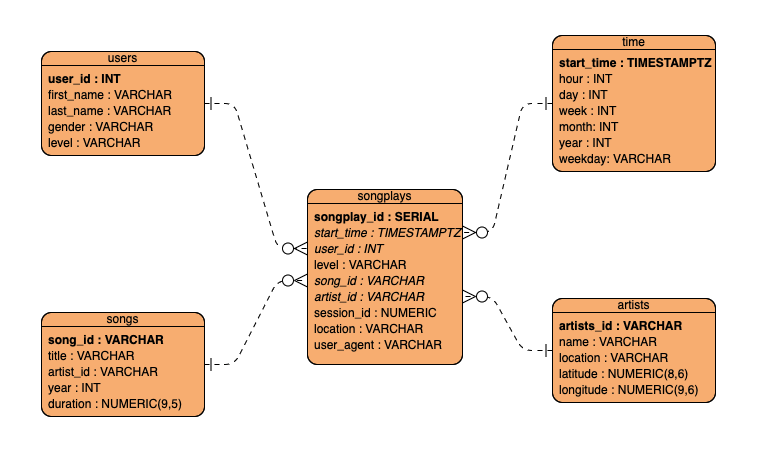

# Data Modeling with Postgres
> Rodrigo Coelho

## Introduction
This is a project of Udacity Data Engineering Nanodegree. In this project, a database is created for **Sparkify**, a startup that has a goal to improve its analytical strengths

## Summary
All ETL steps are applied to give **Sparkify** a star schema model. Start schema has been chosen because is one of the easiest models to use for analysis.
In summary, data is extracted from the JSON source, transformed by using Pandas DataFrame, and loaded into the database. 
Two sets of data are used in the ETL process; song and log data. 
Song data provides song and artist information, while Log data is more extensive; providing covers song, artist, and some metadata about each song. 
Log data is more extensive, providing artist and artist metadata.

## Files
This project is written by using the python language and SQL to manipulate the Postgres database. It contains the following files:
* create_table.py - create and drop all tables and database;
* sql_queries.py - all SQL statements to drop and create tables
* etl.py - functions within all ETL process written to manipulate the data
* etl.ipynb - notebook used to apply the ETL logic
* test.ipynb - notebook used to check if the logic was correctly applied 
* der.png - a picture of the ERD

#### Prerequisites for running the modeling
Prerequisites for running the project are python 3.x and Postgres with a default database named sparkifydb available.

#### Starting
1. Execute "create_tables.py". This will create a fresh instance of the sparkifydb with empty tables.
2. Execute "etl.py". This will load the data into the tables